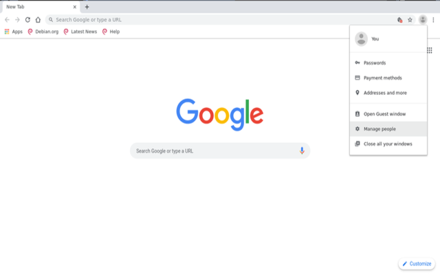
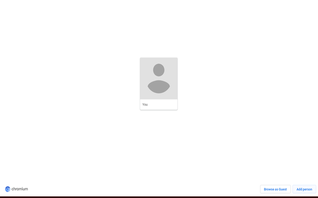
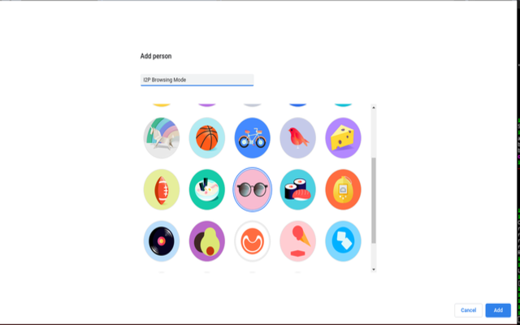
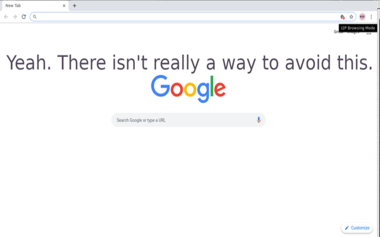
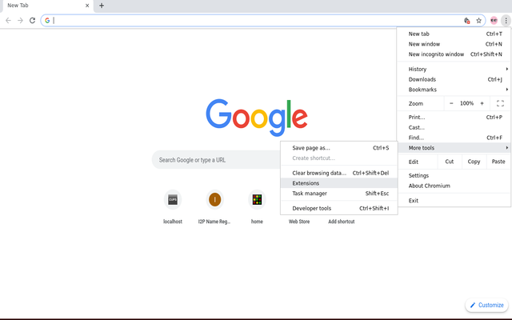
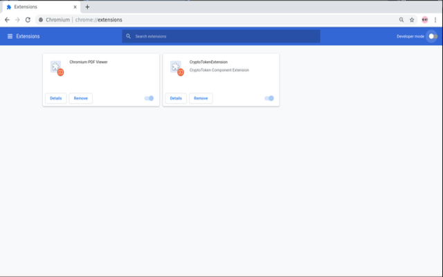
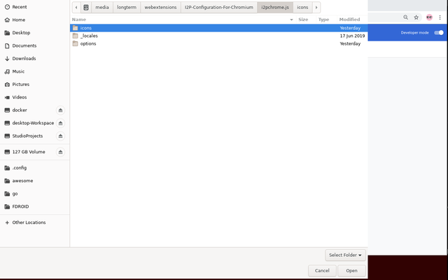
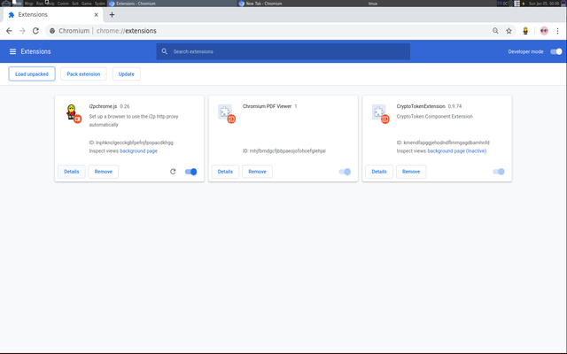

How to tweak a Chromium-Based Web Browser to work with I2P
==========================================================

This is not a recommendation! This is a much more complicated procedure than
we wish to recommend to anyone. A great deal of thought went into the design of
the [Firefox extension](https://github.com/eyedeekay/I2P-in-Private-Browsing-Mode-Firefox),
which is safer and better because of the way Mozilla has designed and maintained
it's webextension privacy API's. Moreover, Chrome is bad for the Internet. So is
Google. If you **must**, absolutely must, use Chrome, then you are part of a
different anonymity set, and in all likelihood, unique. You are subject to
changes in the way Chrome is configured, including possibly unstable
command-line flags which you might use to configure the proxy. This procedure
does not make these risks, which are inherent to the use of Chromium, any
greater or lesser, rather it teaches you to encapsulate a Chromium-based
browsing profile for I2P which is the best that is possible to create with
technology available across all Chromium variants. Also use Chromium or even
better, ungoogled-chromium because Chrome is an advertising delivery vehicle
with trivial browser-like characteristics.

Profile+Plugin Solution, All Platforms
--------------------------------------

This solution is probably the easiest for the majority of people, but it may not
have the best privacy characteristics because it relies on API's and tooling
that Google makes available via extensions, which is pretty narrow.

**Step 1: Create an I2P Browsing Profile**

 * **1A:** Open the people manager to create your I2P persona within Chromium.
 * 
 * **1B:** Add a person named I2P Browsing Mode.
 * 
 * **1C:** Give the person some cool shades to protect them on the *darkweb*.
 * 
 * **1D:** Awwwwwww...
 * 

**Step 2: Install Extension on profile**

*A work-in-progress I2P extension is part of this repository. For now, you*
*have to side-load it in developer mode because it's definitely unfinished.*

 * **2A:** From your new I2P Browsing profile, open the extensions menu.
 * 
 * **2B:** Turn on developer mode to enable loading the extension.
 * 
 * **2C:** Select "Load Unpacked" to install the extension
 * 
 * **2D:** Navigate to the extension directory(this directory/i2pchrome.js) and
 install it.
 * 
 * **2E:** If it worked, you will the the plugin installed in your extensions
 menu.
 * 

Pure Terminal Solution, Unix-Only
---------------------------------

This solution uses a shell script to wrap the Chromium executable and apply
I2P-ready settings.

**Step 1: Create a file named /usr/bin/chromium-i2p with the following**
**contents.**

        #! /usr/bin/env sh
        # Launches Chromium, pre-configured for I2P
        #
        CHROMIUM_I2P="$HOME/i2p/chromium"
        mkdir -p "$CHROMIUM_I2P"
        /usr/bin/chromium --user-data-dir="$CHROMIUM_I2P" \
          --proxy-server="http://127.0.0.1:4444" \
          --proxy-bypass-list=127.0.0.1:7657 \
          --user-data-dir=$HOME/WebApps/i2padmin \
          --safebrowsing-disable-download-protection \
          --disable-client-side-phishing-detection \
          --no-startup-window \
          --disable-3d-apis \
          --disable-accelerated-2d-canvas \
          --disable-remote-fonts \
          --disable-sync-preferences \
          --disable-sync \
          --disable-speech \
          --disable-webgl \
          --disable-reading-from-canvas \
          --disable-gpu \
          --disable-32-apis \
          --disable-auto-reload \
          --disable-background-networking \
          --disable-d3d11 \
          --disable-file-system \
          --app=http://127.0.0.1:7657 $@

### Notes

As you can see, it simply sets a group of flags. Of particular note are
the ```--user-data-dir=$CHROMIUM_I2P``` flag, which forces Chromium to treat
a new directory as the user data directory and prevents your clearnet Chromium
profile from polluting your I2P Chromium profile, and
```--proxy-server="http://127.0.0.1:4444" --proxy-bypass-list=127.0.0.1:7657```
which configure Chromium to use I2P's HTTP Proxy for everything *except* for
router console administration. The rest is just disabling telemetry and features
which may be fingerprintable in an effort to reduce the granularity available to
an attacker trying to measure Chromium.

**Step 2: To also add a shortcut for incognito mode, create another file named**
**/usr/bin/chromium-i2p-incognito with the following contents:**

        #! /usr/bin/env sh
        # Launches Chromium, pre-configured for I2P
        #
        CHROMIUM_I2P="$HOME/i2p/chromium"
        mkdir -p "$CHROMIUM_I2P"
        /usr/bin/chromium-i2p --incognito \
          $@
